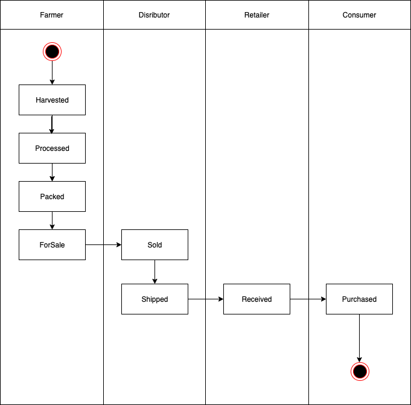
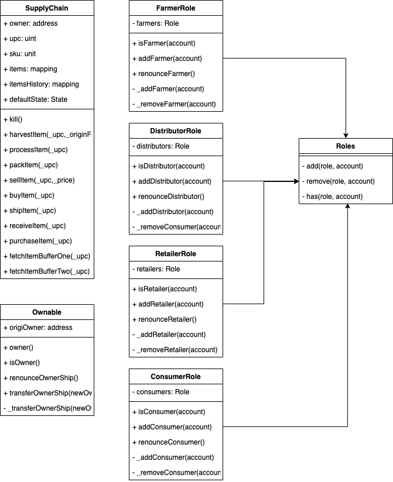
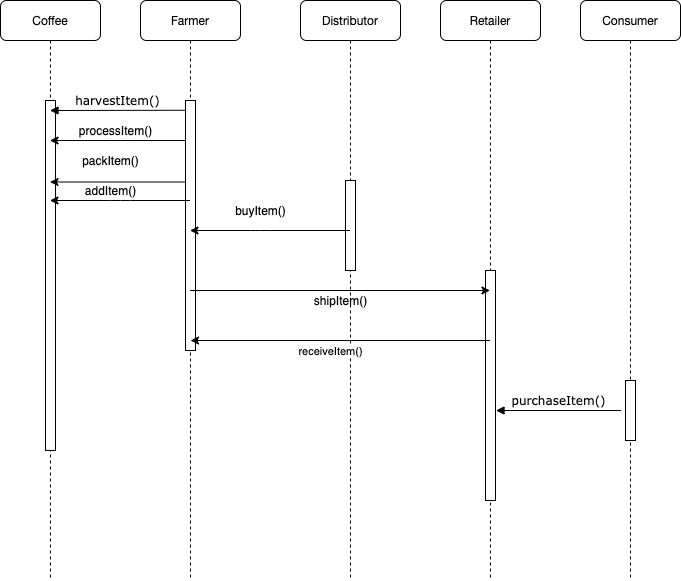
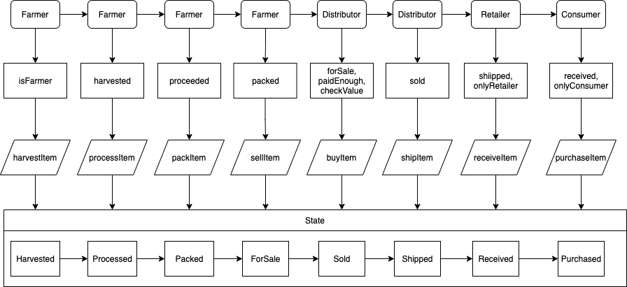

### Deploy Info
https://rinkeby.etherscan.io/address/0x011bdef2736666d90d5928a06f326fb03fa05ce8

- The contract address: 0x011bdef2736666d90d5928a06f326fb03fa05ce8
- Transaction ID: 0x3d42e4cd28b948d11c4eecbe3ae1ee3e1cd6484de7a80471204765dbf0affd10 

### Versions
- Truffle v4.1.14
- Solidity - 0.4.24 (solc-js)
- Node v12.7.0
- Web3.js v1.2.9

### Libraries
- truffle-hdwallet-provider: HD Wallet-enabled Web3 provider. Use it to sign transactions for addresses derived from a 12 or 24 word mnemonic.

### Installing

```
npm install
```

Launch Ganache:

```
ganache-cli -m "spirit supply whale amount human item harsh scare congress discover talent hamster"
```

In a separate terminal window, Compile smart contracts:

```
truffle compile
```

```
truffle migrate
```

Test smart contracts:

```
truffle test
```

```
npm run dev
```

### UML

## Activity



## Class



## Sequence



## State


